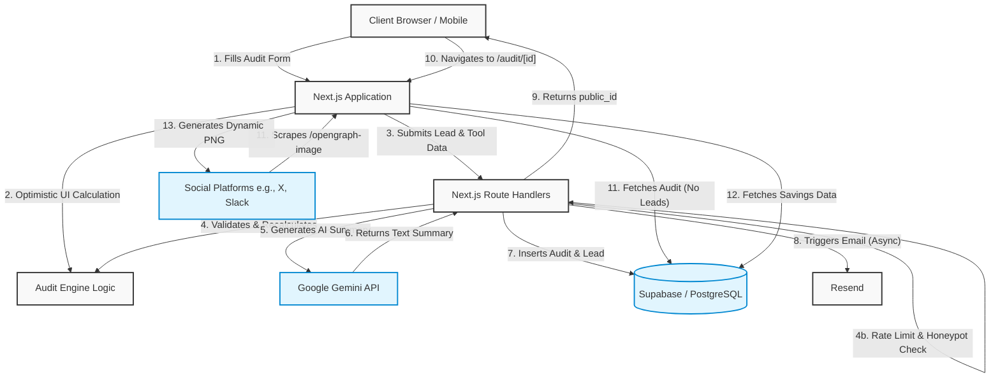
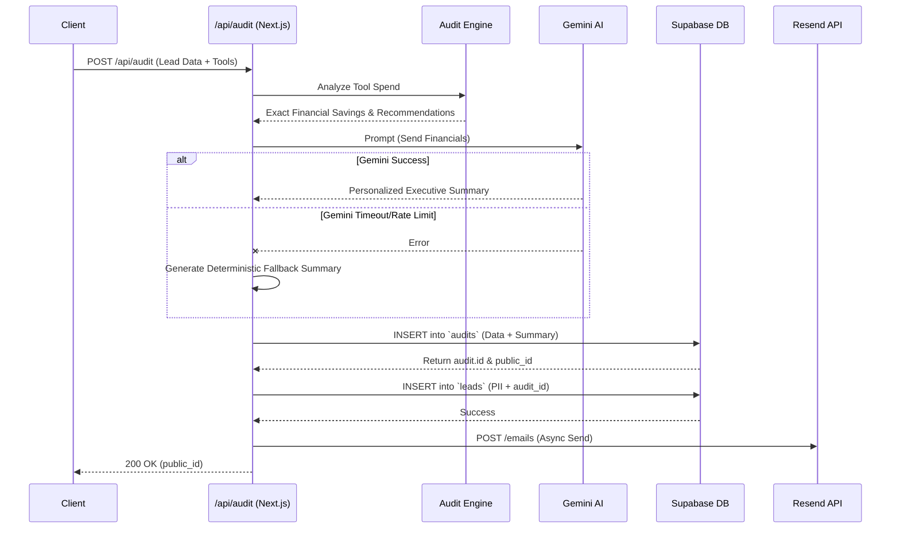

# Architecture & System Design

This document outlines the high-level architecture, data flows, and technical decisions behind the Credex AI Spend Audit platform.

## System Architecture

The application follows a modern serverless architecture utilizing Next.js 15 App Router, edge/node serverless functions, and a managed PostgreSQL database.

## Data Flow

1. **Lead Capture:** The user enters their current AI stack and lead information (email, company size) on the client (`/audit`).
2. **Optimistic Evaluation:** The client uses `react-hook-form` and the `Audit Engine` to instantly show valid tool pricing to the user.
3. **Submission:** Upon clicking submit, a POST request is made to `/api/audit`.
4. **Server Validation:** The API route recalculates the savings using the exact same deterministic `Audit Engine` to prevent client-side manipulation.
5. **AI Augmentation:** The server pings the `Gemini API` with the calculation results to generate a 100-word personalized executive summary. If Gemini times out or fails, a deterministic fallback summary is used.
6. **Data Persistence:** The API executes a two-table insert into Supabase:
   - Inserts the anonymous metrics into `audits` and receives a primary key ID.
   - Inserts the private PII into `leads` using the `audit_id` as a foreign key.
7. **Redirection:** The client is redirected to `/audit/[uuid]`.

## API Flow

The core of the application logic resides in a single, robust API route:

## Database Architecture

We use **Supabase (PostgreSQL)** configured with strict Row-Level Security (RLS) to physically separate viral, shareable data from sensitive lead data.

### 1. `audits` Table
Stores purely anonymous financial data required to render the Results Dashboard and the OpenGraph image.
- `id`: BIGINT (Primary Key)
- `public_id`: UUID (Used for shareable URLs, e.g., `/audit/uuid`)
- `audit_data`: JSONB (Stores the array of tools and financial results)
- `summary`: JSONB (Stores total savings and the AI executive summary text)

### 2. `leads` Table
Stores Personally Identifiable Information (PII) for the sales team.
- `id`: BIGINT (Primary Key)
- `email`: TEXT
- `company`: TEXT
- `role`: TEXT
- `team_size`: INTEGER
- `audit_id`: BIGINT (Foreign Key referencing `audits.id`)

### Security (Row-Level Security)
- **`audits`**: `INSERT` allowed for all users. `SELECT` allowed for all users (public URL generation).
- **`leads`**: `INSERT` allowed for all users. `SELECT` strictly disabled for public access.

## Why this stack was chosen

1. **Next.js 15 App Router:** Provides a hybrid rendering environment. Server Components (`page.tsx`) securely fetch data directly from Supabase, while Client Components (`results-dashboard.tsx`) handle complex Framer Motion animations.
2. **Tailwind CSS + shadcn/ui:** Enables rapid, highly-aesthetic, and accessible UI development without writing verbose custom CSS.
3. **Zustand + React Hook Form:** React Hook Form manages complex, infinitely expanding inputs (adding new AI tools), while Zod ensures the payload is strictly typed before it hits the API.
4. **Supabase:** Offers instant PostgreSQL with built-in RLS. By relying on RLS instead of custom middleware, we guarantee data privacy at the database level.
5. **Vitest:** Chosen over Jest due to its native ES Module and TypeScript support, executing engine tests significantly faster without Babel configuration overhead.

## Scaling Considerations (10k+ Audits/Day)

If the campaign goes viral and sustains 10,000+ audits per day, the current architecture will face specific bottlenecks.

### 1. Gemini API Rate Limits
- **Current state:** Sequential API calls during the `/api/audit` POST request.
- **Problem at scale:** Hitting Gemini's RPS (Requests Per Second) limits will cause high fallback rates.
- **Solution:** Transition AI generation to an asynchronous background queue (e.g., Upstash QStash, or Inngest). The `/api/audit` route would instantly insert the DB record and return the `public_id` to the client. The AI summary would generate in the background. The client dashboard would initially show a "Generating AI Analysis..." skeleton, polling until the summary arrives via Supabase Realtime subscriptions.

### 2. Supabase Connection Pooling
- **Current state:** Standard Supabase data fetching.
- **Problem at scale:** Next.js serverless functions (especially Edge/Serverless APIs) can exhaust PostgreSQL database connections rapidly during traffic spikes.
- **Solution:** Ensure Supavisor (Supabase's built-in connection pooler) is active. Transition the connection string from Port 5432 (direct) to Port 6543 (transaction pooling) in `.env.local`.

### 3. OpenGraph Image Generation Cost
- **Current state:** `next/og` dynamically queries Supabase and generates a PNG on every scrape request.
- **Problem at scale:** Bots (Slack, Twitter, LinkedIn) scrape URLs heavily. Generating complex PNGs on the fly for 10k audits is compute-intensive and could inflate Vercel/Next.js hosting costs.
- **Solution:** Add aggressive caching. Export `revalidate = 31536000` (1 year) on the `opengraph-image.tsx` route since audit results are immutable once generated. This ensures Vercel only generates the image once per UUID and serves it from the Edge CDN forever after.
